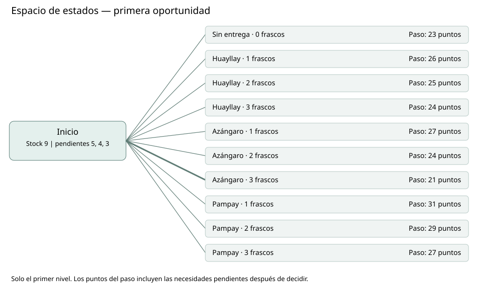
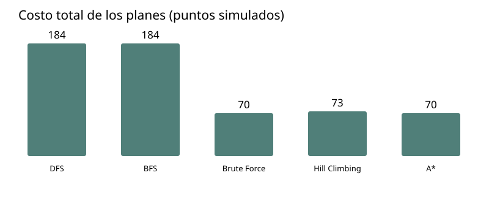
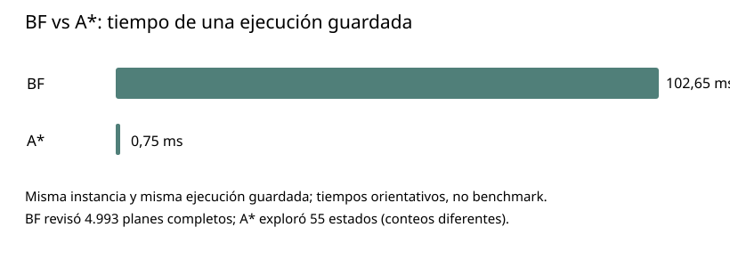

# Challenge 1 · Búsqueda Inteligente y Optimización

**Programación del reabastecimiento de suero fisiológico en Luricocha, Ayacucho**

**Curso:** Machine Learning · **Docente:** Yannick Patrick Carrasco Merma  
**Estudiante:** Cesar Alejandro Aaron Apcho Meneses · **Universidad:** Universidad Peruana Cayetano Heredia

[Notebook de Google Colab](Challenge1_CesarApcho.ipynb) · [Guía web interactiva](https://cesarapcho.github.io/Machine_Learning/Challenge_1/web/)

> **Alcance:** prueba de concepto académica. Los nombres y códigos de establecimientos se emplean como referencias documentales; stock, necesidades, prioridades, kilómetros, costos y entregas son simulados. No es un plan logístico real ni una recomendación clínica.

## 1. Problema y objetivo

El abastecimiento regional de suero fisiológico está documentado por DIRESA Ayacucho. Este challenge pregunta: **¿cómo programar cuatro oportunidades de entrega cuando hay menos frascos que los que solicitan tres establecimientos y llegar a cada uno tiene un costo distinto?**

La meta no es atender pacientes ni encontrar la ruta más corta. Es comparar planes de distribución que respeten el inventario y la capacidad de cada despacho, mientras reducen el costo total de traslado y de necesidades pendientes.

## 2. Escenario de la simulación

El producto es **cloruro de sodio al 0,9 %, presentación de 100 ml**. Hay **9 frascos** frente a **12 solicitados**; por eso quedarán al menos **3 pendientes**. Se permiten **4 oportunidades**, con un máximo de **3 frascos por entrega**.

| Establecimiento | Necesidad | Distancia simulada | Costo de traslado | Prioridad simulada |
|---|---:|---:|---:|---:|
| Huayllay | 5 | 2 km | 2 puntos | 1 |
| Azángaro | 4 | 5 km | 5 puntos | 3 |
| Pampay | 3 | 8 km | 8 puntos | 2 |

La prioridad es un peso del ejercicio, **no** una clasificación clínica; los puntos no equivalen a soles y las distancias no proceden de rutas verificadas.

## 3. Representación y espacio de estados

Un **estado** indica la oportunidad actual, el stock restante y las necesidades pendientes. Una **acción** elige destino y cantidad, o «Sin entrega». Solo se permiten acciones que no excedan stock, necesidad ni capacidad. El **objetivo** es completar las cuatro oportunidades con un plan válido.

*El diagrama muestra solo la **primera decisión**: diez alternativas posibles, no el árbol completo. El «costo del paso» incorpora los frascos que quedarían pendientes, ponderados por prioridad, además del despacho y traslado cuando corresponde.*

El costo completo suma los costos de las cuatro oportunidades y una penalización final por pendientes. En cada oportunidad se calcula la necesidad restante ponderada por prioridad; si se realiza una entrega, se agregan **2 puntos de despacho** y el costo de traslado simulado. Al terminar, se agregan **4 puntos × pendientes ponderados**.

## 4. ¿Qué hace cada algoritmo?

| Método | Cómo trabaja en este challenge |
|---|---|
| **DFS** | Profundiza siguiendo una pila y devuelve el primer plan completo que encuentra. |
| **BFS** | Revisa por niveles usando una cola; no minimiza por sí mismo el costo total. |
| **BF (Brute Force)** | Examina todos los planes completos factibles y conserva el de costo mínimo. |
| **Hill Climbing** | Parte de un plan y lo mejora cambiando una decisión a la vez; puede detenerse en una solución local. |
| **A\*** | Prioriza estados con **f(n) = g(n) + h(n)**: costo acumulado más una estimación inferior del costo restante. |

La heurística de A* estima una parte mínima de la necesidad que no podrá cubrirse con los recursos restantes e ignora traslados futuros; por eso es conservadora en este escenario. **BF y A*** coinciden en 70 puntos en el notebook.

## 5. Resultados

| Algoritmo | Costo simulado | Trabajo reportado | Pendientes finales (H / A / P) |
|---|---:|---|---|
| DFS | 184 | 5 estados | 5 / 4 / 3 |
| BFS | 184 | 137 estados | 5 / 4 / 3 |
| BF | **70** | 4.993 planes completos | 3 / 0 / 0 |
| Hill Climbing | 73 | 102 vecinos | 2 / 1 / 0 |
| A* | **70** | 55 estados | 3 / 0 / 0 |

*Los conteos de «estados», «planes completos» y «vecinos» **no son medidas idénticas**. DFS y BFS encuentran aquí el plan sin entregas, porque su primer objetivo es completar una secuencia válida, no minimizar el costo.*

### BF frente a A*: tiempo observado

En **la ejecución guardada del notebook**, BF tardó **102,65 ms** y A* **0,75 ms**. En esa corrida A* empleó menos tiempo porque priorizó estados usando la heurística, en vez de enumerar todos los planes completos como BF. **No es una prueba de rendimiento general:** los tiempos cambian con el equipo, entorno y cada ejecución. Se compara también el costo final: ambos obtienen **70 puntos**.

## 6. Conclusión y límites

Cambiar prioridades y costos de traslado hace que planes válidos tengan resultados distintos. BF sirve de referencia exhaustiva para esta instancia pequeña; A* alcanza el mismo costo final con búsqueda guiada, y Hill Climbing encuentra un plan cercano, pero no igual, al mínimo. Estos resultados solo describen **la simulación del notebook**. Para un sistema real faltan inventarios, necesidades, tiempos, rutas y costos verificados.

## 7. Referencias del notebook

- DIRESA Ayacucho (2025), [distribución regional de suero fisiológico](https://www.gob.pe/institucion/regionayacucho-diresa/noticias/1152815-diresa-garantiza-el-abastecimiento-de-suero-fisiologico-en-todos-los-establecimientos-de-salud-de-la-region).
- MINSA (2026), [Resolución Ministerial N.° 193-2026-MINSA](https://www.gob.pe/institucion/minsa/normas-legales/7852638-193-2026-minsa).
- DIGEMID (2026), [modernización SISMED 2.6](https://www.digemid.minsa.gob.pe/webDigemid/notas/2026/ministerio-de-salud-moderniza-sistema-para-fortalecer-suministro-de-medicamentos-en-establecimientos-de-salud-y-evitar-su-desabastecimiento/).
- SUSALUD, [catálogo RENIPRESS](https://www.datosabiertos.gob.pe/) para contrastar vigencia de establecimientos. **No se descargó ni verificó aquí un extracto actualizado de RENIPRESS.**
